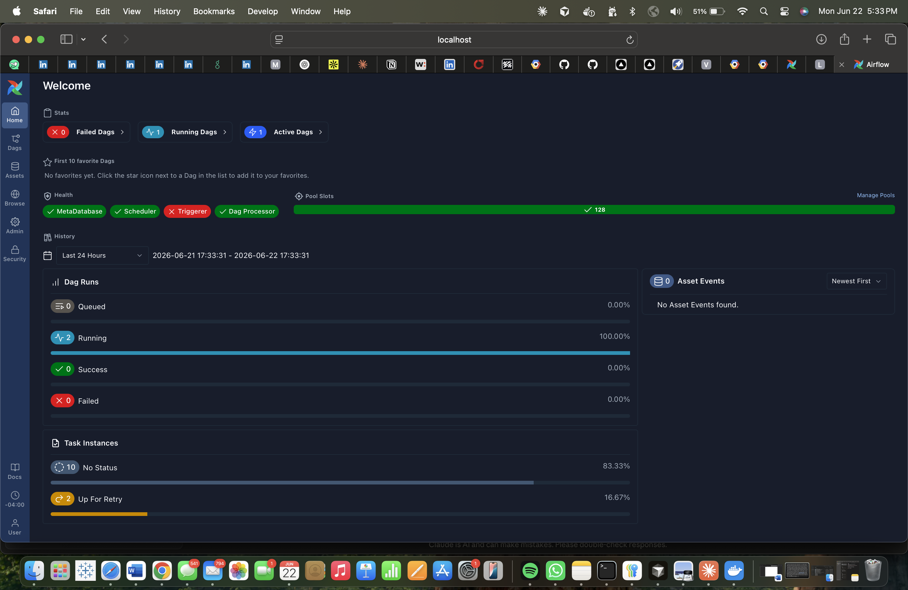
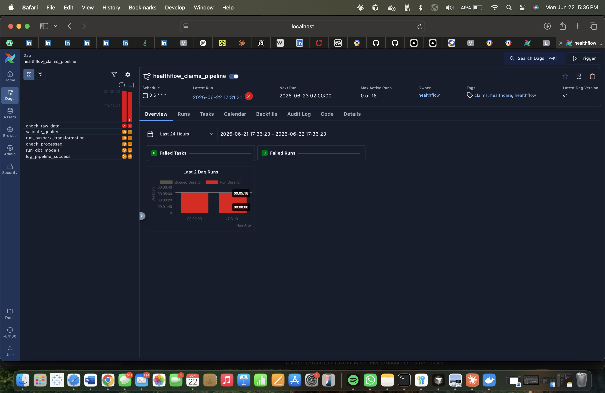
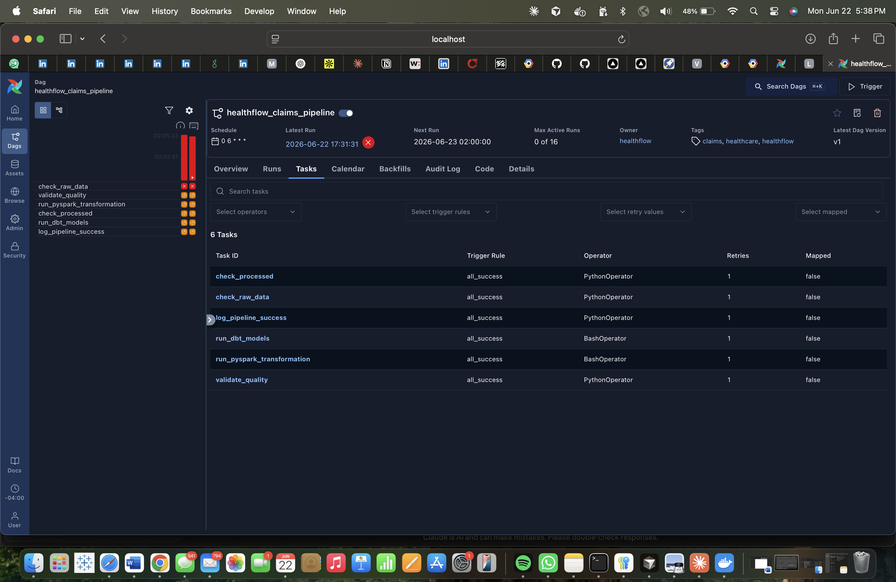
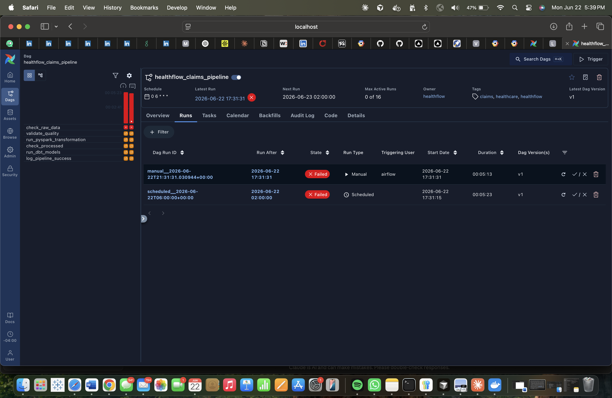
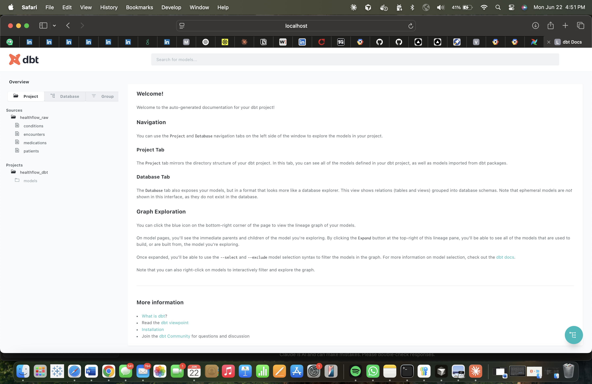
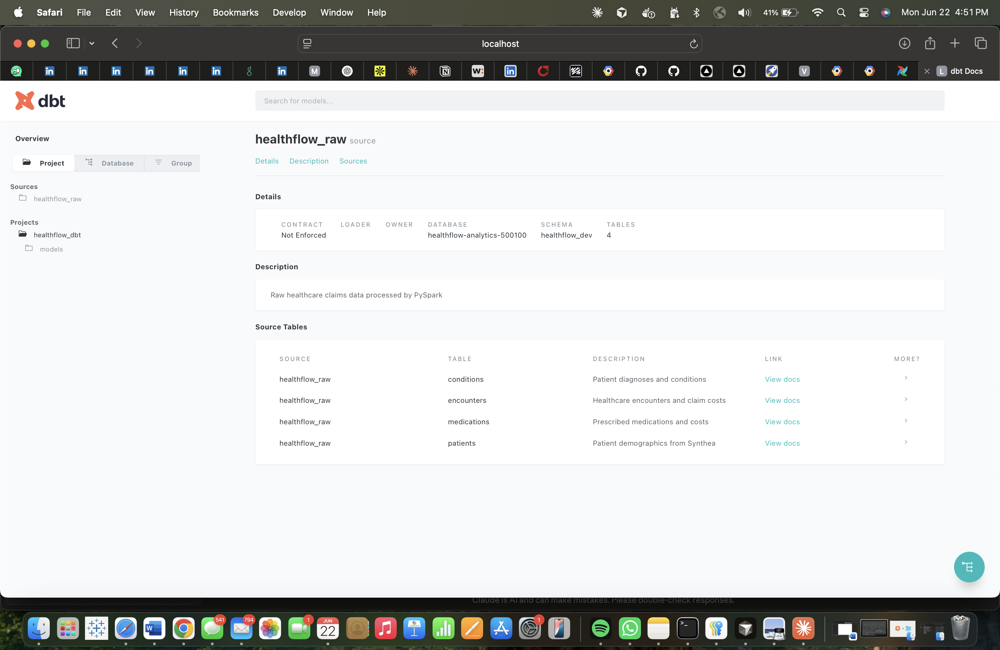
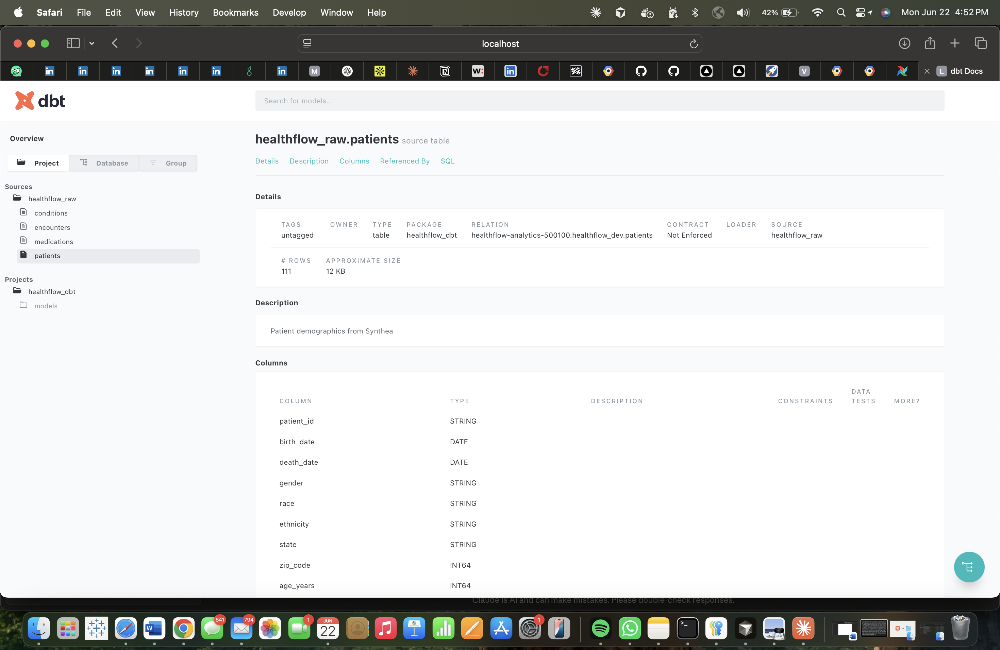
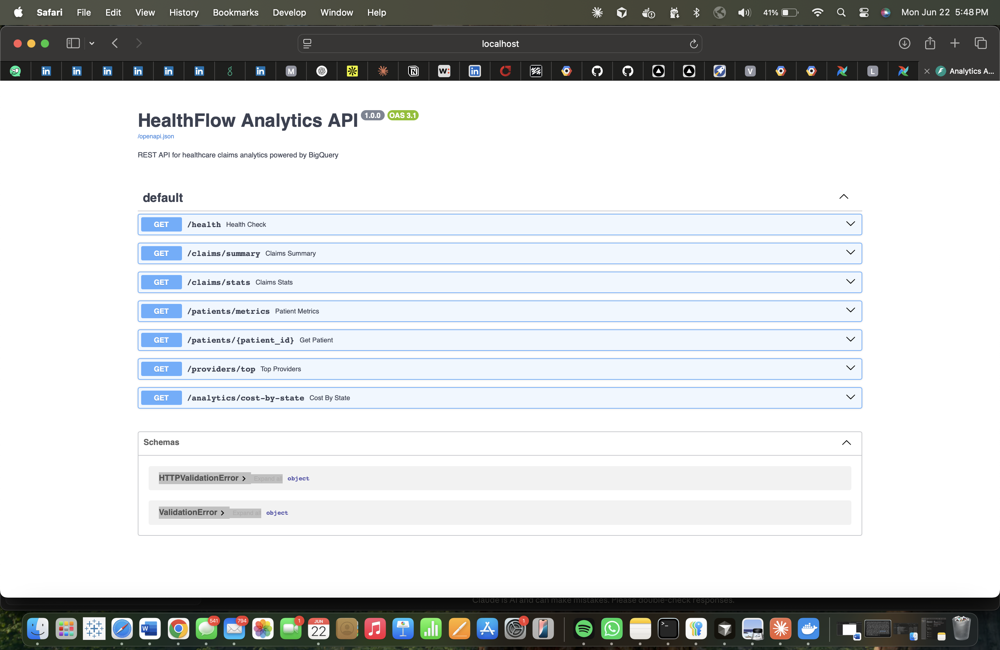

<div align="center">

# 🏥 HealthFlow

### Cloud-Native Healthcare Claims Analytics Pipeline

HealthFlow is an end-to-end data engineering platform that ingests synthetic Medicare claims data, transforms it across a 3-zone AWS data lakehouse, models analytical datasets in Google BigQuery using dbt, and surfaces curated metrics through a live Streamlit analytics dashboard — all orchestrated by Apache Airflow running on Kubernetes.

<br/>

[](https://healthflow006.streamlit.app/)

<br/>


</div>

---

## What It Does

The pipeline ingests [Synthea](https://synthea.mitre.org/) open-source synthetic Electronic Health Records — realistic but entirely fictional patient data — and processes 14,000+ records across 6 clinical tables (patients, encounters, conditions, medications, procedures, observations).

From raw CSVs to analytics-ready REST endpoints, every step is automated, tested, and reproducible.

---

## Key Features

- **3-zone S3 data lakehouse** — raw, processed, and curated zones with Hive-style date partitioning
- **Event-driven ingestion** — AWS Lambda fires on every S3 PutObject in the claims prefix; Glue Crawlers auto-catalog schemas
- **PySpark batch transformation** — raw CSVs converted to Snappy-compressed Parquet in the processed zone
- **dbt analytics engineering** — staging views + mart tables built on BigQuery, with 19/19 data quality tests passing
- **Live Streamlit dashboard** — 5-page analytics app querying BigQuery directly, deployed publicly on Streamlit Cloud with a dark clinical theme
- **Airflow on Kubernetes** — 6-task DAG orchestrates the full pipeline on a daily schedule
- **FastAPI REST API** — 7 endpoints serving live BigQuery data with Swagger docs
- **Infrastructure as Code** — all 18 AWS resources provisioned via Terraform
- **CI/CD** — GitHub Actions runs linting, unit tests, and Terraform format checks on every push

---

## Architecture

```
Synthea Synthetic EHR Data
(14K+ records · 6 tables)
│
▼
┌─────────────────────────────────────────┐
│           Amazon Web Services            │
│                                         │
│  S3 Raw Zone ──────► AWS Glue Catalog   │
│       │                                 │
│       │ (PySpark 3.5)                   │
│       ▼                                 │
│  S3 Processed Zone                      │
│  (Snappy Parquet)                       │
└──────────────┬──────────────────────────┘
               │ (pandas-gbq)
               ▼
┌──────────────────────────────────────┐
│         Google Cloud Platform         │
│                                      │
│  BigQuery ──► dbt Core               │
│              4 staging views         │
│              2 mart tables           │
│              19/19 tests pass ✅      │
└──────────────┬───────────────────────┘
               │
               ▼
        FastAPI REST API          Streamlit Dashboard
         7 live endpoints    ◄──  5 pages · dark theme
         /docs → Swagger          Hosted on Streamlit Cloud
                                  healthflow006.streamlit.app

Apache Airflow 3.x on Kubernetes
orchestrates all stages daily at 06:00 UTC

Terraform provisions all AWS infrastructure
```

---

## Pipeline Workflow

1. **Ingest** — Synthea CSVs uploaded to S3 raw zone with date-based Hive partitioning (`year=/month=/day=`)
2. **Trigger** — AWS Lambda fires on PutObject events; Glue Crawler auto-catalogs the schema into the Glue Data Catalog
3. **Validate** — Great Expectations checks run against the raw zone (row counts, column integrity) — 4/4 tables pass
4. **Transform** — PySpark reads raw CSVs locally, applies type casting and cleaning, writes Snappy-compressed Parquet to the processed zone
5. **Load** — Processed Parquet loaded into BigQuery via pandas-gbq
6. **Model** — dbt builds 4 staging views (patients, encounters, conditions, medications) and 2 mart tables (claims summary, patient metrics) with 19 data quality tests
7. **Serve** — FastAPI exposes curated BigQuery data through 7 REST endpoints with filter support and Swagger UI

---

## Screenshots

### Live Analytics Dashboard

> **[healthflow006.streamlit.app](https://healthflow006.streamlit.app/)** — publicly hosted, queries BigQuery in real time.

The dashboard has 5 pages:
- **Overview** — KPI metrics, monthly claims trend, cost tier breakdown, geographic snapshot
- **Claims Analytics** — filterable by encounter class, cost tier, and age group
- **Patient Explorer** — per-patient rollup with demographic and clinical charts
- **Provider Leaderboard** — ranked by billing volume, claims count, or patient reach
- **Pipeline Overview** — live row counts from BigQuery, dbt test results, tech stack

---

### Apache Airflow on Kubernetes

<table>
<tr>
<td width="50%">

<p align="center"><em>Airflow home — 1 active DAG</em></p>
</td>
<td width="50%">

<p align="center"><em>DAG graph — 6 tasks in sequence</em></p>
</td>
</tr>
<tr>
<td width="50%">

<p align="center"><em>Tasks tab</em></p>
</td>
<td width="50%">

<p align="center"><em>Run history</em></p>
</td>
</tr>
</table>

### dbt Docs

<table>
<tr>
<td width="33%">

<p align="center"><em>dbt docs homepage</em></p>
</td>
<td width="33%">

<p align="center"><em>4 source tables cataloged</em></p>
</td>
<td width="33%">

<p align="center"><em>patients source schema</em></p>
</td>
</tr>
</table>

### FastAPI — Swagger UI



---

## Tech Stack

| Layer | Technology |
|---|---|
| Infrastructure | Terraform · AWS S3 · AWS Lambda · AWS Glue · CloudWatch · IAM |
| Transformation | PySpark 3.5 · Great Expectations |
| Analytics Engineering | dbt Core · Google BigQuery |
| Orchestration | Apache Airflow 3.x · Kubernetes · Helm |
| Serving | FastAPI · Uvicorn |
| Dashboard | Streamlit · Plotly · Streamlit Cloud |
| CI/CD | GitHub Actions |
| Language | Python 3.12 |
| Data Source | Synthea Synthetic EHR |

---

## Skills Demonstrated

- Cloud data lakehouse design (multi-zone S3 with partitioning strategy)
- Infrastructure as Code with Terraform (18 AWS resources, repeatable deploys)
- Event-driven pipeline architecture (Lambda + S3 triggers)
- Distributed batch processing with PySpark
- Analytics engineering with dbt (staging → mart pattern, data quality tests)
- Cloud data warehousing with Google BigQuery
- Pipeline orchestration with Apache Airflow on Kubernetes
- REST API development with FastAPI backed by live warehouse queries
- Data quality validation with Great Expectations
- CI/CD pipeline with GitHub Actions (lint, test, Terraform fmt)
- Container orchestration with Kubernetes and Helm
- Interactive analytics dashboard with Streamlit and Plotly (multi-page, live BigQuery, dark clinical theme)

---

## Future Improvements

- Redis caching layer for high-frequency API endpoints
- Grafana dashboards for pipeline observability and data quality monitoring
- Expand ingestion to all 18 Synthea source tables
- Real-time streaming ingestion with Amazon Kinesis
- Production Kubernetes deployment on Amazon EKS

---

<div align="center">

*All data is 100% synthetic — generated by [Synthea™](https://synthea.mitre.org/) · No real patient information.*

</div>
