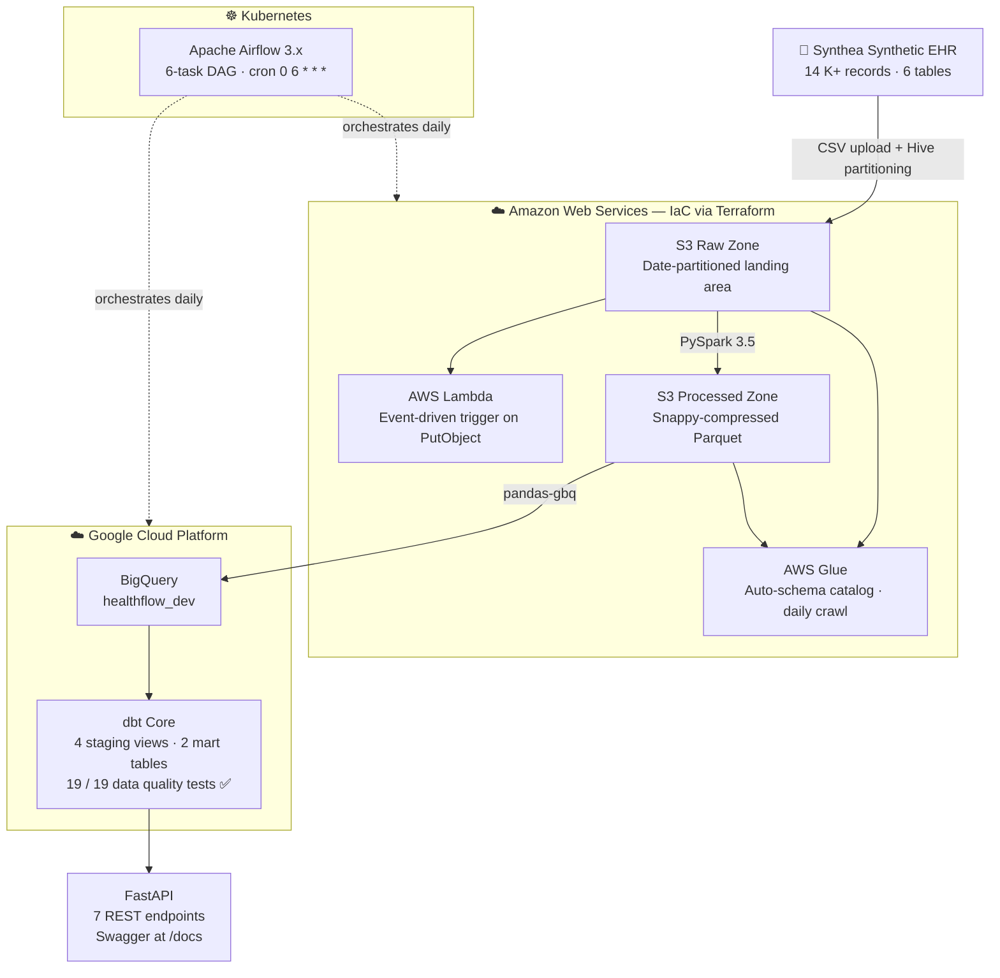

<div align="center">

# 🏥 HealthFlow

**Cloud-Native Healthcare Claims Analytics Platform**

*A production-grade data engineering pipeline built entirely on free-tier cloud services — ingesting synthetic Medicare claims through a 3-zone AWS data lakehouse, transforming them with PySpark and dbt in BigQuery, orchestrated by Apache Airflow on Kubernetes, and served via a FastAPI REST API.*

<br/>


</div>

---

## Table of Contents

- [Architecture](#architecture)
- [Tech Stack](#tech-stack)
- [Data at a Glance](#data-at-a-glance)
- [Screenshots](#screenshots)
- [Getting Started](#getting-started)
- [Running the Pipeline](#running-the-pipeline)
- [API Reference](#api-reference)
- [dbt Models](#dbt-models)
- [Airflow DAG](#airflow-dag)
- [CI/CD](#cicd)
- [Project Structure](#project-structure)

---

## Architecture



---

## Tech Stack

<table>
<tr>
<td valign="top" width="50%">

**Infrastructure & Storage**
| Layer | Tool |
|---|---|
| IaC | Terraform 1.6 |
| Raw / Processed / Curated | Amazon S3 (3-zone lakehouse) |
| Schema Catalog | AWS Glue + Crawlers |
| Event Trigger | AWS Lambda (Python 3.12) |
| Monitoring | CloudWatch Logs + Alarm |

**Transformation**
| Layer | Tool |
|---|---|
| Batch jobs | PySpark 3.5.1 (local mode) |
| Data Validation | Great Expectations |
| Analytical models | dbt Core 1.7 |
| Data Warehouse | Google BigQuery |

</td>
<td valign="top" width="50%">

**Orchestration & Serving**
| Layer | Tool |
|---|---|
| Orchestrator | Apache Airflow 3.x |
| Deployment | Kubernetes (Helm chart) |
| REST API | FastAPI + Uvicorn |
| Docs | Swagger UI (`/docs`) |

**Developer Experience**
| Layer | Tool |
|---|---|
| Language | Python 3.12 |
| CI/CD | GitHub Actions |
| Linting | flake8 |
| Tests | pytest + httpx |
| Secrets | `.env` (python-dotenv) |

</td>
</tr>
</table>

---

## Data at a Glance

The pipeline ingests [Synthea](https://synthea.mitre.org/) open-source synthetic Electronic Health Records — realistic but entirely fictional patient data, safe for public sharing.

| Table | Rows | Zone |
|---|---|---|
| `patients` | 111 | Raw → Processed → BigQuery |
| `encounters` | 6,032 | Raw → Processed → BigQuery |
| `conditions` | 3,817 | Raw → Processed → BigQuery |
| `medications` | 4,227 | Raw → Processed → BigQuery |
| `mart_claims_summary` | 6,032 | BigQuery mart |
| `mart_patient_metrics` | 111 | BigQuery mart |

**Glue catalog:** `healthflow_dev` · **BigQuery datasets:** `healthflow_dev`, `healthflow_dev_staging`, `healthflow_dev_marts`

---

## Screenshots

### Apache Airflow on Kubernetes

<table>
<tr>
<td width="50%">

<p align="center"><em>Airflow home · 1 active DAG</em></p>
</td>
<td width="50%">

<p align="center"><em>DAG graph — 6 tasks in sequence</em></p>
</td>
</tr>
<tr>
<td width="50%">

<p align="center"><em>Tasks tab — operator types</em></p>
</td>
<td width="50%">

<p align="center"><em>Run history</em></p>
</td>
</tr>
</table>

### dbt Docs

<table>
<tr>
<td width="33%">

<p align="center"><em>dbt docs homepage</em></p>
</td>
<td width="33%">

<p align="center"><em>4 source tables cataloged</em></p>
</td>
<td width="33%">

<p align="center"><em>patients source schema</em></p>
</td>
</tr>
</table>

### FastAPI — Swagger UI


---

## Getting Started

### Prerequisites

- Python 3.12
- Java 17 (for PySpark) — `brew install openjdk@17`
- [Terraform](https://developer.hashicorp.com/terraform/install) ≥ 1.6
- [Helm](https://helm.sh/docs/intro/install/) + Kubernetes (enable in Docker Desktop settings)
- AWS CLI configured (`aws configure`)
- GCP service account JSON key with **BigQuery Admin + Job User + Data Editor** roles

### Environment Setup

```bash
# 1. Clone and create virtualenv
git clone https://github.com/<your-username>/healthflow.git
cd healthflow
python3.12 -m venv .venv && source .venv/bin/activate
pip install -r requirements.txt

# 2. Configure environment variables
cp .env.example .env
# → edit .env (see table below)

# 3. Set Java for PySpark
export JAVA_HOME=$(brew --prefix openjdk@17)

# 4. Point to GCP credentials
export GOOGLE_APPLICATION_CREDENTIALS="/path/to/gcp-key.json"
```

**Required `.env` variables:**

| Variable | Description |
|---|---|
| `AWS_REGION` | AWS region (e.g. `us-east-1`) |
| `AWS_ACCOUNT_ID` | Your 12-digit AWS account ID |
| `RAW_BUCKET` | S3 raw zone bucket name |
| `PROCESSED_BUCKET` | S3 processed zone bucket name |
| `CURATED_BUCKET` | S3 curated zone bucket name |
| `GCP_PROJECT` | GCP project ID |
| `BQ_DATASET` | BigQuery dataset (e.g. `healthflow_dev`) |
| `GOOGLE_APPLICATION_CREDENTIALS` | Absolute path to GCP service account JSON |

### Provision AWS Infrastructure

```bash
cd terraform
terraform init
terraform plan
terraform apply      # provisions 18 AWS resources (free-tier eligible)
cd ..
```

### Deploy Airflow on Kubernetes

```bash
kubectl create namespace healthflow
helm repo add apache-airflow https://airflow.apache.org
helm upgrade --install airflow apache-airflow/airflow \
  --namespace healthflow \
  --values orchestration/helm/airflow-values.yaml

# Expose the UI
kubectl port-forward svc/airflow-api-server -n healthflow 8082:8080
# → http://localhost:8082  (admin / admin)
```

---

## Running the Pipeline

Run each step manually, or let Airflow handle daily scheduling at 06:00 UTC.

```bash
# Activate environment first
source .venv/bin/activate
export JAVA_HOME=$(brew --prefix openjdk@17)
export GOOGLE_APPLICATION_CREDENTIALS="/path/to/gcp-key.json"

# 1. Upload Synthea CSVs → S3 raw zone (Hive-partitioned by date)
python ingestion/upload_to_s3.py

# 2. Validate raw data quality (Great Expectations — 4/4 tables)
python ingestion/validate_raw.py

# 3. PySpark: CSV → Snappy-compressed Parquet → S3 processed zone
python transformation/pyspark/transform_claims.py

# 4. Load Parquet → BigQuery
python ingestion/load_to_bigquery.py

# 5. dbt: run 6 models + 19 tests
cd transformation/dbt/healthflow_dbt
dbt run && dbt test

# 6. Start FastAPI (live BigQuery queries)
cd /path/to/healthflow
python -m uvicorn serving.fastapi.main:app --reload --port 8001
# → http://localhost:8001/docs

# Optional: serve dbt lineage docs
cd transformation/dbt/healthflow_dbt
dbt docs generate && dbt docs serve --port 8081
```

---

## API Reference

Base URL: `http://localhost:8001` · Interactive docs: [/docs](http://localhost:8001/docs)

| Method | Endpoint | Description | Query Params |
|---|---|---|---|
| `GET` | `/health` | Service health + version | — |
| `GET` | `/claims/summary` | Paginated claims list from BigQuery | `limit`, `encounter_class`, `cost_tier`, `age_group` |
| `GET` | `/claims/stats` | Aggregate stats by class / cost tier / age | — |
| `GET` | `/patients/metrics` | Patient-level cost & utilisation | `limit`, `age_group`, `state` |
| `GET` | `/patients/{patient_id}` | Single patient record | — |
| `GET` | `/providers/top` | Top providers ranked by total billed | `limit` |
| `GET` | `/analytics/cost-by-state` | Claims cost breakdown by US state | — |

**Example request:**

```bash
curl "http://localhost:8001/claims/summary?encounter_class=ambulatory&cost_tier=high&limit=5"
```

---

## dbt Models

```
models/
├── staging/                   # materialised as views
│   ├── stg_patients           # demographics, derived age_group
│   ├── stg_encounters         # class, dates, cost fields, cost_tier bucketing
│   ├── stg_conditions         # ICD-10 codes with onset / stop dates
│   └── stg_medications        # drug dispenses, cost, payer coverage
└── marts/                     # materialised as tables
    ├── mart_claims_summary    # 6,032 rows — one row per encounter with patient enrichment
    └── mart_patient_metrics   # 111 rows — lifetime utilisation rollup per patient
```

All 6 models pass **19 / 19 dbt tests** (unique, not_null, accepted_values).

---

## Airflow DAG

**ID:** `healthflow_claims_pipeline` · **Schedule:** `0 6 * * *` · **Tags:** `healthflow`, `healthcare`, `claims`

```
check_raw_data
    │   checks S3 raw partition exists for today's date
    ▼
validate_quality
    │   Great Expectations checks on patients / encounters / conditions / medications
    ▼
run_pyspark_transformation
    │   PySpark: CSV → Snappy Parquet → S3 processed zone
    ▼
check_processed
    │   verifies Parquet files landed in processed zone
    ▼
run_dbt_models
    │   dbt run: 4 staging views + 2 mart tables
    ▼
log_pipeline_success
        logs XCom metrics: raw object count, quality results, processed sizes
```

Deployed via the official Apache Airflow Helm chart into the `healthflow` Kubernetes namespace. Running pods: `api-server`, `dag-processor`, `scheduler`, `postgresql`.

---

## CI/CD

GitHub Actions workflow: `.github/workflows/ci.yml` — runs on every push and pull request to `main`.

| Step | Details |
|---|---|
| **Lint** | `flake8` across `ingestion/`, `transformation/pyspark/`, `serving/` (max-line 120) |
| **Unit tests** | `pytest tests/` — FastAPI endpoint tests with mocked BigQuery client |
| **dbt validation** | Counts `.sql` and `.yml` model files |
| **Terraform fmt** | `terraform fmt -check` — fails on unformatted `.tf` files |
| **CI summary** | Step summary: DAG file count, API endpoint count, key checks |

---

## Project Structure

```
healthflow/
├── terraform/                       # AWS infrastructure as code — 18 resources
│   ├── main.tf · variables.tf · outputs.tf
│   ├── s3.tf                        # 3-zone S3 lakehouse (raw / processed / curated)
│   ├── lambda.tf · iam.tf           # ingestion trigger + least-privilege IAM
│   ├── glue.tf                      # Glue catalog DB + 2 crawlers
│   └── cloudwatch.tf                # log group + Lambda error alarm
├── ingestion/
│   ├── upload_to_s3.py              # Synthea CSVs → S3 with Hive date partitioning
│   ├── validate_raw.py              # Great Expectations quality checks (4/4 PASS)
│   ├── load_to_bigquery.py          # S3 Parquet → BigQuery via pandas-gbq
│   └── lambda_handler.py            # S3-event-driven Lambda trigger
├── transformation/
│   ├── pyspark/transform_claims.py  # PySpark 3.5 batch job (CSV → Snappy Parquet)
│   └── dbt/healthflow_dbt/
│       ├── models/staging/          # stg_patients / stg_encounters / stg_conditions / stg_medications
│       ├── models/marts/            # mart_claims_summary / mart_patient_metrics
│       └── dbt_project.yml
├── orchestration/
│   ├── dags/healthflow_pipeline.py  # 6-task Airflow DAG (daily @ 06:00 UTC)
│   └── helm/airflow-values.yaml     # Helm values for Airflow 3.x on Kubernetes
├── serving/
│   └── fastapi/main.py              # 7 REST endpoints — live BigQuery queries
├── k8s/
│   ├── airflow/namespace.yaml
│   └── fastapi/                     # K8s deployment · service · configmap
├── tests/
│   └── test_api.py                  # pytest unit tests (FastAPI TestClient)
├── Screenshots/                     # Airflow, dbt docs, FastAPI Swagger screenshots
├── .github/workflows/ci.yml         # GitHub Actions CI/CD pipeline
├── requirements.txt
├── .env.example                     # env var template (never commit .env)
└── .gitignore
```

---

<div align="center">

Built to demonstrate end-to-end data engineering across AWS, GCP, Kubernetes, and the modern data stack.

*All data is 100% synthetic — generated by [Synthea™](https://synthea.mitre.org/) · No real patient information.*

</div>
